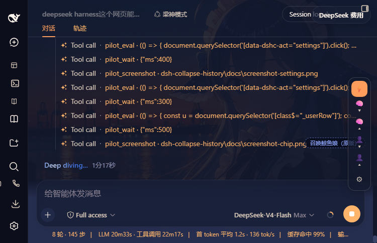

# 🗂️ dsh-collapse-history

> Fold thinking & user questions in DeepSeek Harness Web conversations — automatically and manually. **Recent items always stay expanded.**

A zero-build, dependency-free **client plugin** for [DeepSeek Harness](https://github.com/deepseek-ai/deepseek-harness) Web (DSH). It collapses long **thinking (Think) rows** and **user question bubbles** in older conversation history so you can scroll and review context without endless walls of text — while the latest `N` items remain fully visible.

⭐ **Star this repo if you find it useful** — it helps the project grow!

---

## ✨ Features

| Feature | Description |
| --- | --- |
| ⚡ **Auto fold (default ON)** | Older thinking rows & user questions fold automatically; the most recent `N` stay expanded. |
| 🧠 **Think rows** | One click folds/unfolds any thinking block (built-in behavior kept); bulk **fold/expand all thinking** buttons. |
| 👤 **User questions** | Each question gets a fold button; folded questions collapse into a compact chip — click to expand. |
| 📌 **Manual pins** | Anything you toggle by hand is *pinned* — auto mode never undoes your choice. |
| 🎛 **Settings popover** | Tune `keep-recent N` for thinking and questions, toggle auto mode, clear pins, reset defaults. |
| 💾 **Persistent** | Settings are saved to `localStorage` and survive page reloads. |
| 🌗 **Native look** | Styled with the app's own design tokens (`--dsw-alias-*`), works in light & dark themes. |
| 🌐 **i18n** | UI follows the browser language (中文 / English). |
| 🧩 **Zero build, zero deps** | Hand-written client bundle, no toolchain, no runtime dependencies. |

## 🎬 Demo


*Auto fold → fold all thinking → expand all → fold/expand questions → settings.*

## 📸 Screenshots

| Auto-folded history (toolbar bottom-right) | Settings popover |
| --- | --- |
|  |  |

Folded user question chip:



## 📦 Install

> Requires DSH ≥ `0.1.1-rc.1` and the `web` profile.

### Option A — from this repo (recommended)

```bash
dsh plugin --profile web add github:hengxiangdeheng-jpg/dsh-collapse-history
```

### Option B — from npm (once published)

```bash
dsh plugin --profile web add dsh-collapse-history
```

### Option C — local directory

```bash
dsh plugin --profile web add link:D:/path/to/dsh-collapse-history
```

Then **register the loader entry** — either:

1. Add `dsh-collapse-history` to the `dsh.profile.bundles` list in `~/.dsh/profiles/web/package.json` (its own `cordis.patch.yml` registers itself), **or**
2. Append to `~/.dsh/profiles/web/cordis.patch.yml`:

```yaml
- insert:
    - id: dsh-collapse-history
      name: 'dsh-collapse-history'
```

Finally restart the web profile:

```bash
dsh web
```

## 🎮 Usage

A small floating toolbar appears at the bottom-right of the conversation column:

| Button | Action |
| --- | --- |
| ⚡ | Toggle **auto fold** on/off |
| 🧠▾ / 🧠▴ | **Collapse / expand all** thinking rows (pins them) |
| 👤▾ / 👤▴ | **Collapse / expand all** user questions (pins them) |
| ⚙ | Open **settings**: keep-recent `N` for thinking & questions, clear pins, reset |

Per-message:

- **Thinking**: click the Think row header (built-in disclosure). Manually toggled rows are pinned automatically.
- **Question**: use the small `▾` button next to the copy action, or click the folded chip to expand.

## ⚙️ Configuration

Stored in `localStorage` (`dsh-collapse-history:settings:v1`), editable from the ⚙ popover:

| Key | Default | Range | Meaning |
| --- | --- | --- | --- |
| `auto` | `true` | bool | Master switch for auto folding |
| `thinkKeep` | `2` | 0–10 | How many **most recent** thinking rows stay expanded |
| `userKeep` | `3` | 0–10 | How many **most recent** questions stay expanded |

## 🛠 How it works

- Pure **DOM-level** client plugin: a `MutationObserver` watches the conversation column (`[data-pane="conversation"]`, stamped by the web-ui compat shim — the plugin stamps it itself if missing).
- Think rows are identified by the stable `[data-variant="think"]` attribute; toggling reuses the built-in disclosure (`[data-disclosure-row="true"]`), so **no React internals are touched**.
- User rows are identified by the stable `[class$="_userRow"]` CSS-module suffix.
- Auto passes run inside `requestAnimationFrame`, coalescing React mutation bursts into one pass.
- Streaming rows (`data-state="running"`) are never touched.

## ⚠️ Limitations

- Pin state is per-DOM-element: switching sessions or heavy re-renders may reset manual pins (auto mode re-applies immediately).
- Works with the built-in conversation view. The details/trajectory panes are intentionally untouched.

## 🗺 Roadmap

- [ ] Fold entire assistant messages (text + tools) as one unit
- [ ] Per-session fold-state memory
- [ ] Collapse-all hotkeys
- [ ] Visual settings page integration (`dsh-client-ui-settings`)

## 📄 License

[MIT](./LICENSE) © dsh-collapse-history contributors