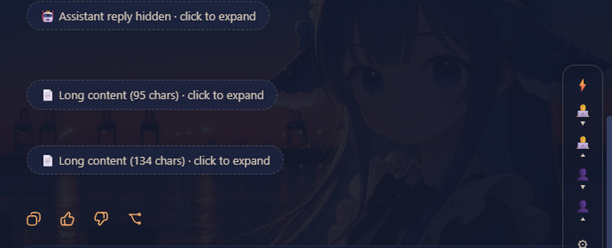

# 🗂️ dsh-collapse-history

> Fold **entire conversation turns** in DeepSeek Harness Web — automatically and selectively. **Hide all assistant replies to see only your messages**, or keep only the assistant's answers. Recent turns always stay expanded.

A zero-build, dependency-free **client plugin** for [DeepSeek Harness](https://github.com/deepseek-ai/deepseek-harness) Web (DSH). Long conversations become a tidy timeline of chips: every assistant turn (thinking + reply + tool calls) and every user message can be folded into one line — the most recent \`N\` turns remain fully visible.

⭐ **Star this repo if you find it useful** — it helps the project grow!

---

## ✨ Features

| Feature | Description |
| --- | --- |
| ⚡ **Auto fold (default ON)** | Older **assistant replies** fold automatically; the most recent \`N\` stay expanded (set \`0\` to fold every assistant reply). **Your messages are never auto-folded**, so browsing history stays natural. |
| 🧑‍💻 **Hide all assistant replies** | Every assistant turn (thinking, text, tool calls) collapses into a chip — **you see only your own questions**. |
| 👤 **Hide all your messages** | The reverse view: only the assistant's replies remain. |
| 📄 **Fold long content** | Any single message longer than the threshold (default 800 chars) folds into a chip automatically — with a hover fold button for manual folding. |
| 🖱 **One-click expand** | Click any chip to expand that turn or block. Manually toggled turns are *pinned* — auto mode never undoes your choice. |
| 🎛 **Settings popover** | Tune \`keep-recent N\` for assistant replies and user messages, toggle auto mode, clear pins, reset defaults. |
| 💾 **Persistent** | Settings are saved to \`localStorage\` and survive page reloads. |
| 🌗 **Native look** | Styled with the app's own design tokens (\`--dsw-alias-*\`), light & dark themes. |
| 🌐 **i18n** | UI follows the browser language (中文 / English). |
| 🧩 **Zero build, zero deps** | Hand-written client bundle, no toolchain, no runtime dependencies. |

## 🎬 Demo

*Auto fold (assistant-only) → hide all assistant replies → show all → hide all user messages → show all.*

## 📸 Screenshots

| Auto-folded history | Only your messages (all assistant replies hidden) |
| --- | --- |
|  |  |

| Only assistant replies (your messages hidden) | Long content auto-folded |
| --- | --- |
|  |  |

| Settings |
| --- |
|  |

## 📦 Install

> Requires DSH ≥ \`0.1.1-rc.1\` and the \`web\` profile.

### Option A — from this repo (recommended)

\`\`\`bash
dsh plugin --profile web add github:hengxiangdeheng-jpg/dsh-collapse-history
\`\`\`

### Option B — from npm (once published)

\`\`\`bash
dsh plugin --profile web add dsh-collapse-history
\`\`\`

### Option C — local directory

\`\`\`bash
dsh plugin --profile web add link:D:/path/to/dsh-collapse-history
\`\`\`

Then **register the loader entry** — either:

1. Add \`dsh-collapse-history\` to the \`dsh.profile.bundles\` list in \`~/.dsh/profiles/web/package.json\` (its own \`cordis.patch.yml\` registers itself), **or**
2. Append to \`~/.dsh/profiles/web/cordis.patch.yml\`:

\`\`\`yaml
- insert:
    - id: dsh-collapse-history
      name: 'dsh-collapse-history'
\`\`\`

Finally restart the web profile:

\`\`\`bash
dsh web
\`\`\`

## 🎮 Usage

A small floating toolbar appears at the bottom-right of the conversation column:

| Button | Action |
| --- | --- |
| ⚡ | Toggle **auto fold** on/off |
| 🧑‍💻▾ / 🧑‍💻▴ | **Hide / show all assistant replies** (pins them) |
| 👤▾ / 👤▴ | **Hide / show all your messages** (pins them) |
| ⚙ | Open **settings**: keep-recent \`N\`, clear pins, reset |

Per turn: click a chip to expand it; clicking the chip again (or using the toolbar) re-folds it. Your manual choices are pinned and survive auto passes until you clear pins.

## ⚙️ Configuration

Stored in \`localStorage\` (\`dsh-collapse-history:settings:v2\`), editable from the ⚙ popover:

| Key | Default | Range | Meaning |
| --- | --- | --- | --- |
| \`auto\` | \`true\` | bool | Master switch for auto folding |
| \`assistantKeep\` | \`1\` | 0–10 | How many **most recent assistant replies** stay expanded (\`0\` = fold every assistant reply) |
| \`maxChars\` | \`800\` | 0–100000 | Fold any single message longer than this many characters (\`0\` = never fold by length) |

## 🛠 How it works

- Pure **DOM-level** client plugin: a \`MutationObserver\` watches the conversation column (\`[data-pane="conversation"]\`, stamped by the web-ui compat shim — the plugin stamps it itself if missing).
- The message list is composed of **flow items** (\`[class$="_flowItem"]\`); each user message is one flow item, and each assistant turn is the consecutive run of flow items between two user messages (thinking rows, markdown, tool calls, context markers).
- Folding hides the turn's content with CSS and shows a compact chip; the observer re-applies state after every React render.
- Streaming turns (\`data-state="running"\`) are never folded.

## ⚠️ Limitations

- Pin state is per-DOM-element: switching sessions or heavy re-renders may reset manual pins (auto mode re-applies immediately).
- Works with the built-in conversation view. The details/trajectory panes are intentionally untouched.

## 🗺 Roadmap

- [ ] Per-session fold-state memory
- [ ] Collapse-all hotkeys
- [ ] Visual settings page integration (\`dsh-client-ui-settings\`)

## 📄 License

[MIT](./LICENSE) © dsh-collapse-history contributors