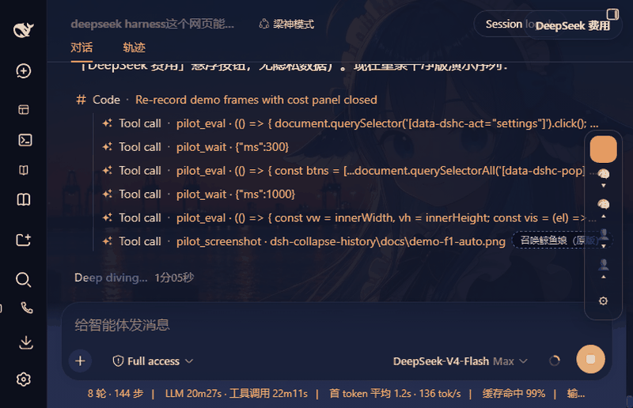
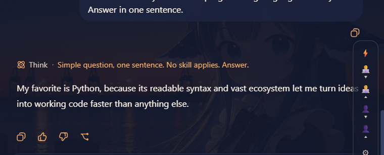
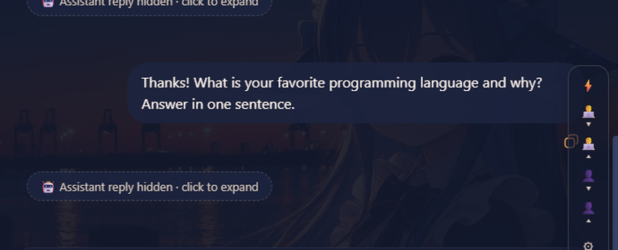
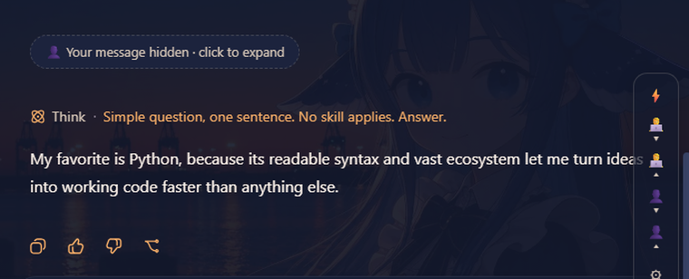
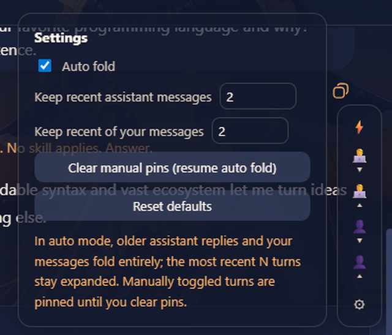

# 🗂️ dsh-collapse-history

> DeepSeek Harness Web 对话折叠插件：**自动 + 选择性折叠整轮对话**——一键隐藏助手全部回复、只留你发的问题（反过来也行），最近 N 轮始终保持展开。

这是 [DeepSeek Harness](https://github.com/deepseek-ai/deepseek-harness)（DSH）Web 的**零构建、零依赖客户端插件**。长对话变成清爽的胶囊时间线：每一条**助手回复**（思考过程 + 正文 + 工具调用）和每一条**你的消息**都能收成一行，最近 N 轮完整可见。

⭐ **觉得好用就点个 Star**，帮助项目成长！

---

## ✨ 功能特性

| 功能 | 说明 |
| --- | --- |
| ⚡ **自动折叠（默认开启）** | 只自动折叠较旧的**助手回复**，最近 N 条保持展开（设为 0 可全部折叠）；**你的消息永远不会被自动折叠**，浏览历史不打断。 |
| 🧑‍💻 **隐藏全部助手回复** | 每条助手轮次（思考、正文、工具调用）整段收成胶囊——**界面只剩你的问题**。 |
| 👤 **隐藏全部你的消息** | 反过来：只保留助手的回复。 |
| 🖱 **点击即展开** | 点任意胶囊即可展开该轮；手动操作过的轮次会被「固定」，自动模式不会覆盖。 |
| 🎛 **设置面板** | 分别设置助手/你的消息保留条数 N、自动开关、清除固定、恢复默认。 |
| 💾 **设置持久化** | 保存在 `localStorage`，刷新不丢。 |
| 🌗 **原生外观** | 使用应用自带设计令牌（`--dsw-alias-*`），亮/暗主题自适应。 |
| 🌐 **国际化** | 跟随浏览器语言（中文 / English）。 |
| 🧩 **零构建零依赖** | 手写客户端包，无需工具链与运行时依赖。 |

## 🎬 效果演示



*自动折叠（仅助手）→ 隐藏全部助手回复 → 全部显示 → 隐藏全部你的消息 → 全部显示。*

## 📸 界面截图

| 自动折叠后的历史 | 只留你的问题（隐藏全部助手回复） |
| --- | --- |
|  |  |

| 只留助手回复（隐藏你的消息） | 设置面板 |
| --- | --- |
|  |  |

## 📦 安装

> 需要 DSH ≥ `0.1.1-rc.1` 与 `web` profile。

### 方式 A —— 直接从本仓库（推荐）

```bash
dsh plugin --profile web add github:hengxiangdeheng-jpg/dsh-collapse-history
```

### 方式 B —— 从 npm（发布后可用）

```bash
dsh plugin --profile web add dsh-collapse-history
```

### 方式 C —— 本地目录

```bash
dsh plugin --profile web add link:D:/path/to/dsh-collapse-history
```

然后**注册 loader 条目**，二选一：

1. 把 `dsh-collapse-history` 加进 `~/.dsh/profiles/web/package.json` 的 `dsh.profile.bundles`（插件自带 `cordis.patch.yml` 自动注册）；**或**
2. 在 `~/.dsh/profiles/web/cordis.patch.yml` 追加：

```yaml
- insert:
    - id: dsh-collapse-history
      name: 'dsh-collapse-history'
```

最后重启 web profile：

```bash
dsh web
```

## 🎮 使用说明

对话列右下角悬浮工具条：

| 按钮 | 作用 |
| --- | --- |
| ⚡ | 切换**自动折叠** |
| 🧑‍💻▾ / 🧑‍💻▴ | **隐藏 / 显示全部助手回复**（并固定） |
| 👤▾ / 👤▴ | **隐藏 / 显示全部你的消息**（并固定） |
| ⚙ | **设置**：保留条数 N、清除固定、恢复默认 |

逐轮操作：点击胶囊展开该轮；再点一次（或用工具条）收回。手动操作过的轮次会被固定，直到清除固定。

## ⚙️ 配置

保存在 `localStorage`（`dsh-collapse-history:settings:v2`），可在 ⚙ 弹窗修改：

| 键 | 默认 | 范围 | 含义 |
| --- | --- | --- | --- |
| `auto` | `true` | 布尔 | 自动折叠总开关 |
| `assistantKeep` | `2` | 0–10 | 最近多少条**助手回复**保持展开 |
| `userKeep` | `2` | 0–10 | 最近多少条**你的消息**保持展开 |

## 🛠 实现原理

- 纯 **DOM 层**客户端插件：`MutationObserver` 监听对话列（`[data-pane="conversation"]`，web-ui 兼容层打标，缺失时插件自补）。
- 消息流由 **flow item**（`[class$="_flowItem"]`）组成：每条用户消息是一个 flow item；每条助手回复是相邻两条用户消息之间的一串 flow item（思考、正文、工具调用、上下文标记）。
- 折叠用 CSS 隐藏该轮内容并显示紧凑胶囊；每次 React 重渲染后观察器自动恢复状态。
- 流式输出中的轮次（`data-state="running"`）不会被折叠。

## ⚠️ 已知限制

- 固定状态跟随 DOM 元素存活：切换会话或大幅重渲染后可能失效（自动折叠会立即重新生效）。
- 只作用于内置对话视图；详情/轨迹面板刻意不动。

## 🗺 路线图

- [ ] 按会话记忆折叠状态
- [ ] 全局折叠快捷键
- [ ] 接入可视化设置页（`dsh-client-ui-settings`）

## 📄 许可证

[MIT](./LICENSE) © dsh-collapse-history contributors